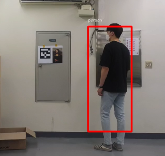

# Curator Drone
**2021-1st semester**
**Python, yolo, olympe**
## 예시 사진

## Procedure

### Tracking

* 사람을 인식하는데 Yolo를 사용하였다.
* red box dhk simple algorithm을 이용해 사람들을 추적할 수 있었다.

  

### AR-Marker

* 그림을 인식하는데 AR-Marker을 사용하였다.
* 각각의 그림이 특정 AR-Marker을 가르킨다.

### crawling

* 그림이 인식되면 드론이 자동적으로 위키피디아에서 그림에 대한 정보를 찾는다.
* 그리고 오디오 파일에 정보를 담아서 사용자에게 이메일로 전송한다.

## 어려웠던 점

## Limitations
* yolo-tiny의 정확도가 높지 않아 사용자 주위에서 drone rotate을 하지 못하였다.
* Drone 과 laptop이 wifi로 연결되있기 때문에 서로 가까이 있어야 했다. 그래서 드론과 서버를 연결하는 다른 방법을 찾아야 했다.
* 드론이 정보를 찾을 때 끝까지 수행할 때까지 드론은 멈춰있었다.

## What I've learned
* Yolo framework를 embedded system에서 어떻게 이용하는지
* 다른 개발자들과 협력하는 법

